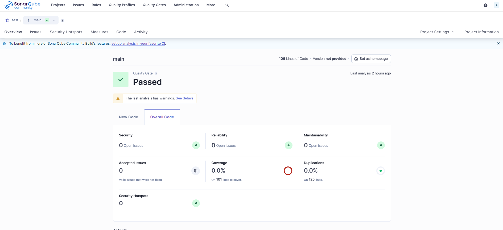
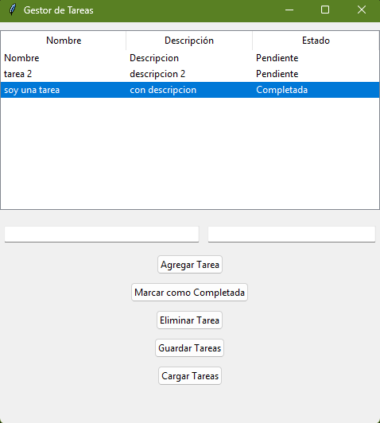

Lista de tareas en python 

simple app "To-do" creada en python 

## Instalacion

Para iniciar el proyecto debes descargar el proyecto y montarlo en su env creado previamente.

para cargar las dependencias necesarias del proyecto en la carpeta raiz del proyecto ejecute:
```bash
  pip install -r /requirements.txt
```

Luego de instalar las dependencias, puede ejecutar el programa con el siguente comando:

```bash
  py ./src/task_manager.py
```

    
## Screenshots





## Funciones

- Agregar tareas: Crear nuevas tareas con título y descripción.
- Marcar tareas como completadas: Cambiar el estado de la tarea a "Completada".
- Eliminar tareas: Eliminar tareas de la base de datos.
- Exportar tareas: Exportar todas las tareas a un archivo JSON.
- Importar tareas: Cargar tareas desde un archivo JSON.
